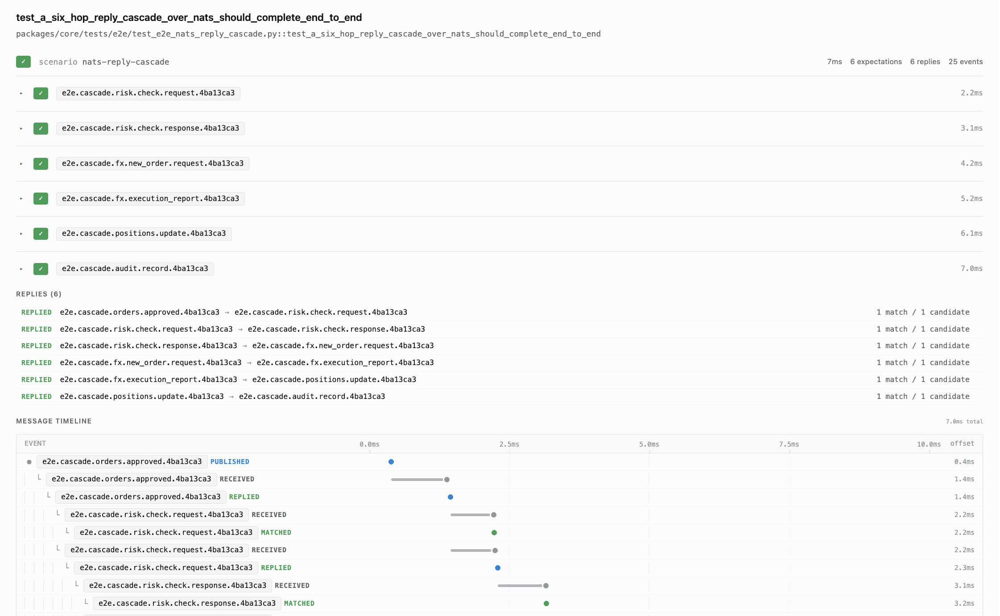

# Choreo

*Because distributed systems are a dance, and someone has to count the beats.*

An async Python test framework for **message-driven systems**. Write tests that
declare *"when I publish X, I expect Y"* and the harness handles the routing,
correlation, timing, and reporting for you — one, two, three, publish, expect,
await.

The library is **transport-agnostic**. You plug in a transport — mock for unit
tests, NATS for end-to-end, your own for LBM / Kafka / RabbitMQ / anything else —
and the same scenario DSL works against all of them. It ships with an
[interactive HTML + JSON test report](#test-report) that renders a Jaeger-style
waterfall of every message, match, reply, and latency budget.

- Python 3.11+, no runtime dependencies.
- `pytest`, `pytest-asyncio`, and `pyyaml` are test extras only.
- `nats-py` is an optional extra (`pip install 'core[nats]'`) for the e2e suite.
- Packages ship `py.typed`; consumers get full mypy coverage.

---

## When to use this

Use this framework when your system is **message-driven** and your tests need
to assert on what comes back over the wire — event pipelines, pub/sub fan-out,
request/reply services, sagas, workflow orchestrators, IoT telemetry, CQRS
read models.

What it gives you:

- **Scoped test isolation.** Each scenario gets a fresh correlation ID; a
  hundred scenarios can share one broker connection without cross-contamination.
- **Structured matching.** First-class matchers (`field_equals`,
  `contains_fields`, `all_of`, `any_of`, …) against decoded payloads — not
  regex against log lines.
- **Per-expectation latency budgets.** Declare `within_ms(50)` and the handle
  resolves as `SLOW` rather than `PASS` if it matched late.
- **Near-miss diagnostics.** A `TIMEOUT` with zero near-misses is a routing
  bug; a `TIMEOUT` with non-empty near-misses is an expectation bug. The
  report tells you which.
- **Reply primitives.** `on(topic).publish(reply_topic, builder)` lets a test
  react to inbound messages — useful for staging fake upstream services.
- **HTML + JSON reports** rendered at suite exit, with timeline, diffs,
  credential redaction, and `pytest-xdist` merge support.

Not a good fit for: pure unit tests with no I/O, HTTP request/response testing
(use `httpx` + `respx`), or synchronous Python-only fakes.

---

## Install

```bash
# Editable install with test extras
pip install -e 'packages/core[test]'

# Optional: NATS transport for the e2e suite
pip install -e 'packages/core[test,nats]'

# Optional: the pytest reporter plugin (HTML + JSON output)
pip install -e 'packages/core-reporter[test]'
```

Both packages build with Hatchling and ship `py.typed`.

---

## Architecture at a glance

```
  ┌──────────┐   publish    ┌──────────────────┐
  │   test   │ ───────────▶ │ system under test │
  └────┬─────┘              └─────────┬─────────┘
       │                              │  reply (on the wire)
       │                              ▼
       │                    ┌──────────────────┐
       │                    │   Loop-poster    │  move off the network thread
       │                    └─────────┬────────┘
       │                              ▼
       │                    ┌──────────────────┐
       │                    │   Dispatcher     │  "whose reply is this?"
       │                    └─────────┬────────┘
       │                              ▼
       │    handle fulfilled  ┌──────────────┐
       └────────────────────◀ │   Scenario   │
                              └──────────────┘
```

Four dancers on the floor:

**Harness** — the session-scoped coordinator. You construct one with a
Transport and call `connect()`. The transport runs its allowlist check,
opens its socket, and reports ready. When the suite ends, `disconnect()`
tears everything down.

**Scenario** — the per-test scope. Opening one generates a correlation ID
(`TEST-{env}-{uuid}`) that gets stamped onto every message the test
publishes. The scenario owns its expectations, replies, and timeline, and
cleans them up on exit (normal or exception).

**Dispatcher** — the router. Every inbound message lands here. It pulls the
correlation ID out of the payload and hands the message to the scenario
that claimed it. Unmatched messages go to a **surprise log** (metadata
only; payloads redacted per ADR-0009).

**Loop-poster** — the thread-safe bridge. Network backends (LBM, Kafka,
anything non-asyncio-native) deliver messages on their own thread. The
loop-poster uses `loop.call_soon_threadsafe` to hop those messages onto
the asyncio loop before the dispatcher sees them. Without it, you'd get
race conditions that vanish when you add a `print()`.

---

## Quick start

### 1. Define an allowlist

Endpoints the harness is allowed to talk to. One flat YAML file per
deployment; categories are transport-defined. Production endpoints **never**
appear in any checked-in allowlist.

```yaml
# config/allowlist.yaml
lbm_resolvers: ["lbmrd:15380", "localhost:15380"]
nats_servers:  ["nats://localhost:4222"]
```

### 2. Write a scenario

```python
from pathlib import Path

from core import Harness
from core.transports import MockTransport
from core.matchers import contains_fields, gt


async def test_the_adapter_should_respond_with_pass_when_a_request_matches() -> None:
    transport = MockTransport(
        allowlist_path=Path("config/allowlist.yaml"),
        lbm_resolver="lbmrd:15380",
    )
    harness = Harness(transport)
    await harness.connect()

    async with harness.scenario("happy") as s:
        s.expect("events.processed", contains_fields({
            "status": "PASS",
            "event": {
                "item_id": "ITEM-42",
                "count": gt(0),
            },
        }))
        s = s.publish("events.processed", {
            "status": "PASS",
            "event": {"item_id": "ITEM-42", "count": 1000},
        })
        result = await s.await_all(timeout_ms=500)

    result.assert_passed()
    await harness.disconnect()
```

Swap `MockTransport` for `NatsTransport(servers=[...], allowlist_path=...)`
or any other backend and nothing above the transport constructor changes.

In real consumer repos, wrap `Harness` in a session-scoped `pytest_asyncio`
fixture (see [Downstream consumer pattern](#downstream-consumer-pattern)).

### 3. Run tests

```bash
pytest              # unit suite via MockTransport, no network
pytest -m e2e       # real broker via NatsTransport, needs docker compose
```

`pytest-asyncio` runs in `auto` mode with a session-scoped loop, so
`async def` tests need no decorator. The default `addopts` enables
`pytest-xdist` (`-n auto`); scenarios are isolated by correlation ID so
parallel runs don't collide.

---

## The Scenario DSL

A scenario moves through three states. Each state exposes only the methods
valid at that point — illegal transitions raise `AttributeError` at runtime
(ADR-0012).

```
┌─────────┐ expect()/on() ┌───────────┐ publish() ┌───────────┐ await_all() ┌──────────────────┐
│ BUILDER ├──────────────▶│ EXPECTING ├──────────▶│ TRIGGERED ├────────────▶│ ScenarioResult   │
└─────────┘               └───────────┘           └───────────┘             └──────────────────┘
```

### `expect(topic, matcher) → Handle`

Subscribes to `topic`, filters by the scenario's correlation ID, applies
`matcher` to the decoded payload. Returns a **Handle** you can hold for
post-hoc assertions.

```python
h = s.expect("events.processed", field_equals("status", "COMPLETED"))
h.within_ms(50)           # declare a latency SLA (optional)
```

After `await_all()` returns, the Handle exposes:

| Field | What it tells you |
|---|---|
| `outcome` | `PASS` / `FAIL` / `TIMEOUT` / `SLOW` / `PENDING` |
| `message` | decoded payload |
| `latency_ms` | elapsed time from registration to match |
| `attempts` | count of near-misses (messages on correlation that failed matcher) |
| `last_rejection_reason` | prose from the most recent near-miss |
| `last_rejection_payload` | decoded payload of that near-miss |
| `failures` | structured `MatchFailure` tree (capped at 20) |
| `was_fulfilled()` | True iff outcome is `PASS` |

Reading `message` or `latency_ms` while `outcome == PENDING` raises
`RuntimeError` (ADR-0014).

### `publish(topic, payload) → Scenario`

Sends a message through the transport. `payload` can be either raw `bytes`
(passed through untouched) or a `dict` (codec-encoded; defaults to JSON).
When you pass a dict, the scenario automatically injects its
`correlation_id` unless you've put one in already — handy for negative
tests that want to send the wrong ID on purpose.

```python
s = s.publish("events.created", {"count": 1000, "item_id": "ITEM-42"})
```

### `await_all(timeout_ms) → ScenarioResult`

Waits for every registered handle to resolve or the deadline to fire.
Returns a `ScenarioResult`:

| Field / method | Purpose |
|---|---|
| `result.passed` | True iff every handle outcome is `PASS` |
| `result.assert_passed()` | raises `AssertionError` with breakdown on failure |
| `result.handles` | tuple of every handle |
| `result.failing_handles` | handles where `outcome != PASS` |
| `result.timeline` | chronological events: PUBLISHED / RECEIVED / MATCHED / MISMATCHED / DEADLINE / REPLIED / REPLY_FAILED |
| `result.replies` | per-`on()` reply lifecycle reports |
| `result.failure_summary()` | multi-line diagnostic including last 20 timeline entries |
| `result.reply_at(trigger_topic)` | lookup a reply by its trigger topic |

`assert_passed()` is the canonical assertion — its message distinguishes a
*silent timeout* (nothing arrived, routing bug) from a *near-miss*
(messages arrived but failed the matcher, expectation bug).

---

## Replies — `on().publish()`

A scenario can register a **reply**: when a matching message arrives on
a trigger topic, publish a response. The framework ships the primitive;
consumers compose them into bundles for their own domains. Handy for
staging fake upstream services inside a test without standing up a second
process.

```python
async with harness.scenario("instant_reply") as s:
    h = s.expect(
        "reply.received",
        contains_fields({"status": "COMPLETED", "count": 100}),
    )

    s.on("request.sent").publish(
        "reply.received",
        lambda msg_received: {
            "correlation_id": msg_received["correlation_id"],
            "status": "COMPLETED",
            "count": msg_received["count"],
        },
    )

    s = s.publish("request.sent", {"correlation_id": "REQ-1", "count": 100})
    result = await s.await_all(timeout_ms=500)

result.assert_passed()

report = result.reply_at("request.sent")
assert report.state.name == "REPLIED"
assert report.match_count == 1
```

Rules:

- Must be registered **before** `publish()` — it's a pre-trigger
  arrangement, not a background subscription (ADR-0016).
- Fires **once per scope** — the chain is single-use; calling `.publish()`
  a second time on the same `ReplyChain` raises `ReplyAlreadyBoundError`.
- The `matcher` argument is optional; `None` means *every inbound on the
  topic matches*.
- The `payload` can be a static `dict`, static `bytes`, or a callable
  `Callable[[decoded_trigger], dict | bytes]`.
- Failures in the builder function are captured as exception **class name
  only** in the report — never `str(e)`, so secrets from a failing builder
  never leak into the report (ADR-0017).

Each registered reply produces a `ReplyReport` in `result.replies`:

| Field | Meaning |
|---|---|
| `state` | `ARMED_NO_MATCH` / `ARMED_MATCHER_REJECTED` / `REPLIED` / `REPLY_FAILED` |
| `candidate_count` | messages that arrived on the trigger topic |
| `match_count` | how many passed the optional matcher |
| `reply_published` | whether the reply actually went out |
| `builder_error` | exception class name if the builder raised |

---

## Matchers

Matchers live in `core.matchers`. They compose into expressive predicates
over decoded payloads. See [docs/guides/matchers.md](docs/guides/matchers.md)
for the full cookbook.

### Flat field matchers

```python
from core.matchers import (
    field_equals, field_ne, field_in, field_gt, field_lt,
    field_exists, field_matches,
)

s.expect("reading", field_equals("sensor_id", "SENSOR-01"))
s.expect("tick",    field_in("region", ("eu-west", "us-east", "ap-south")))
s.expect("result",  field_gt("count", 0))
s.expect("result",  field_lt("latency_ms", 1000.0))
s.expect("evt",     field_exists("trace_id"))
s.expect("evt",     field_ne("status", "REJECTED"))
s.expect("evt",     field_matches("order_id", r"^ORD-\d+$"))
```

Paths come in three forms:

- **Dotted string** — sugar for the common case. Numeric segments are
  treated as list indices, so `"items.0.id"` walks into a list.
- **Bare int** — a single-level lookup, useful for integer-keyed payloads
  (tag-value maps): `field_equals(35, "D")`.
- **Sequence** (tuple or list) — the canonical form. It is the only way
  to reach a dict key that literally contains `"."`, and it disambiguates
  a string key `"0"` from a list index `0`:

  ```python
  field_equals(("trace.id",), "abc")          # dict key with a dot
  field_equals(("items", "0"), "x")            # string key "0" on a dict
  field_equals(("items", 0), "x")              # list index 0
  field_equals(("fills", 0, "price"), 100.25)  # mixed nesting
  ```

### Nested shape matching

`contains_fields` does a recursive **subset** match over dicts and lists.
Leaves can be literals or other matchers.

```python
from core.matchers import contains_fields, eq, ne, in_, gt, lt, matches, exists, all_of, not_

s.expect("events.processed", contains_fields({
    "event": {
        "status":     "COMPLETED",
        "count":      gt(0),
        "amount":     all_of(gt(0.0), lt(10_000.0)),
        "order_id":   matches(r"^ORD-\d+$"),
        "trace_id":   exists(),
    },
    "steps":  [{"state": in_(("NEW", "PART"))}],
    "actor":  not_(in_(("blocked_1", "blocked_2"))),
}))
```

### Composition and list quantifiers

```python
from core.matchers import all_of, any_of, not_, every, any_element

all_of(field_equals("kind", "CREATE"), field_gt("count", 0))
any_of(field_equals("status", "COMPLETED"), field_equals("status", "PART_COMPLETED"))
not_(field_equals("status", "REJECTED"))

# List quantifiers — use inside contains_fields or at the top level.
every(field_gt("px", 0.0))                       # every element passes
any_element(field_equals("side", "BUY"))         # at least one element passes
```

A list-quantifier inside a shape match expresses "there exists a fill with
px > 100" in one line:

```python
contains_fields({"order": {"fills": any_element(field_gt("px", 100.0))}})
```

Three layers deep is the rule of thumb before factoring out into a named
matcher.

### Raw-bytes escape hatch

When you need to match on a non-JSON payload (a fixed-width wire format,
a binary blob), `payload_contains` does a substring check on the raw bytes.
It **requires a `bytes` payload** and raises `TypeError` otherwise — if
you have a decoded dict or string, use `field_matches` / `contains_fields`
instead.

```python
from core.matchers import payload_contains

s.expect("frames.echo", payload_contains(b"MAGIC"))
```

### Writing your own

A matcher is anything implementing the `Matcher` Protocol — `description: str`
plus `match(payload) → MatchResult`. For a side-by-side expected/actual
diff in the report, also implement the optional `Reportable` Protocol
(`expected_shape()`); matchers without it fall back to `description`.
Build one as a frozen dataclass and compose it exactly like the built-ins.

---

## Transports

The library ships two transports and defines a 5-method `Transport`
Protocol so you can drop in your own.

### `MockTransport`

In-memory pub/sub. Synchronous dispatch (subscribers fire before
`publish()` returns). Optionally validates `lbm_resolver` against an
allowlist.

```python
from pathlib import Path
from core.transports import MockTransport

transport = MockTransport(
    allowlist_path=Path("config/allowlist.yaml"),   # optional
    lbm_resolver="lbmrd:15380",                     # optional
)
```

Diagnostic methods (for testing your test code, not your system):
`transport.sent()`, `transport.active_subscription_count()`,
`transport.clear_subscriptions()`.

### `NatsTransport`

Talks to a real NATS broker. Lazy-imported — `nats-py` is only required if
you actually construct one. Good for exercising the Transport contract
against a real network without standing up production infrastructure.

```python
from pathlib import Path
from core.transports import NatsTransport

transport = NatsTransport(
    servers=["nats://localhost:4222"],
    allowlist_path=Path("config/allowlist.yaml"),
    name="my-suite",           # reported to broker (default: "choreo")
    connect_timeout_s=5.0,     # total connect budget
)
```

Validates `nats_servers` in the allowlist.

### Writing your own transport

Drop a module under
[packages/core/src/core/transports/](packages/core/src/core/transports/)
implementing the five-method `Transport` Protocol. The `connect()`
implementation is where your allowlist enforcement, credential handling,
and socket setup all live — the Harness never sees those details.

```python
from typing import Protocol, Callable, Optional

TransportCallback = Callable[[str, bytes], None]
OnSent = Callable[[], None]

class Transport(Protocol):
    async def connect(self) -> None: ...
    async def disconnect(self) -> None: ...
    def subscribe(self, topic: str, callback: TransportCallback) -> None: ...
    def unsubscribe(self, topic: str, callback: TransportCallback) -> None: ...
    def publish(
        self,
        topic: str,
        payload: bytes,
        *,
        on_sent: Optional[OnSent] = None,
    ) -> None: ...
```

Follow the pattern in [mock.py](packages/core/src/core/transports/mock.py)
(synchronous) or [nats.py](packages/core/src/core/transports/nats.py)
(asyncio-native). The `on_sent` callback is how you report post-wire
timing to the timeline — fire it after the message is on the wire, on
the asyncio loop thread.

---

## Test report



The **core-reporter** package is a pytest plugin that writes an
interactive HTML report and a structured JSON file at the end of every
pytest run.

Install and it's active — no explicit opt-in needed (via pytest11 entry
point).

```bash
pip install -e 'packages/core-reporter[test]'

# Run your tests as usual
pytest

# Output (default location)
ls .harness-report/
# index.html   results.json   assets/

# Custom location
pytest --harness-report=/tmp/my-report

# Disable entirely
pytest --harness-report-disable
```

What the report includes:

- **Scenario list** with pass/fail/slow/timeout counts at a glance.
- **Jaeger-style waterfall timeline** for each scenario — every publish,
  receive, match, mismatch, reply, and deadline event plotted on one axis.
- **Expected-vs-actual diffs** for failing handles, driven by
  `matcher.expected_shape()`.
- **Per-reply lifecycle** — was it armed? did it match? did it fire?
- **Git metadata** per test (commit, branch, author).
- **Credential redaction.** All payloads pass through a pluggable redactor
  chain. Register custom rules:

  ```python
  from core_reporter import register_redactor

  def mask_api_keys(text: str) -> str:
      return re.sub(r"sk-[A-Za-z0-9]{32}", "sk-REDACTED", text)

  register_redactor(mask_api_keys)
  ```

- **pytest-xdist support.** Each worker writes partial JSON; the reporter
  merges them at session end.

---

## Downstream consumer pattern

The `core` package is designed to be installed as a library by separate
repos that test their own services. It ships no pytest fixtures and reads
no environment variables — those are consumer decisions.

```python
# consumer-repo/conftest.py
import os
from pathlib import Path

import pytest_asyncio

from core import Harness
from core.transports import MockTransport


@pytest_asyncio.fixture(loop_scope="session", scope="session")
async def harness():
    transport = MockTransport(
        allowlist_path=Path(os.environ.get("MY_APP_ALLOWLIST", "config/allowlist.yaml")),
        lbm_resolver=os.environ["MY_APP_LBM_RESOLVER"],
    )
    h = Harness(transport)
    await h.connect()
    try:
        yield h
    finally:
        await h.disconnect()


# consumer-repo/tests/test_events.py
from core.matchers import contains_fields


async def test_a_created_event_should_produce_a_state_change(harness):
    async with harness.scenario("state_change") as s:
        s.expect("state.changed", contains_fields({"count": 1000}))
        s = s.publish("events.created", {"count": 1000, "item_id": "ITEM-42"})
        result = await s.await_all(timeout_ms=500)

    result.assert_passed()
```

The library has no opinion about which transport you pick, what you name
your env vars, or where you keep your allowlist files. Those are
deployment concerns.

---

## Running end-to-end tests

The unit suite runs entirely in-memory via `MockTransport`. A separate e2e
suite exercises the Transport Protocol against a real network by pointing
`NatsTransport` at a disposable NATS broker.

```bash
# Install the NATS extra
pip install -e 'packages/core[test,nats]'

# Bring up the broker (port 4222)
docker compose -f docker/compose.e2e.yaml up -d

# Run just the e2e suite
pytest -m e2e

# Tear down
docker compose -f docker/compose.e2e.yaml down
```

If `nats-py` isn't installed, or no broker is reachable at `NATS_URL`
(default `nats://localhost:4222`), the e2e suite **skips** rather than
fails. CI should treat a skip there as the compose stack not coming up.

Override the broker URL with `NATS_URL` — but add the URL to the
`nats_servers` category in your allowlist first, or `connect()` will refuse.

---

## Linting and formatting

Ruff is the single source of truth for lint and format across the monorepo.
Config lives in the root `pyproject.toml` under `[tool.ruff]`. Pre-commit
runs it on every commit; CI enforces the same check on every PR.

```bash
# One-time local setup
pip install pre-commit
pre-commit install

# Manual invocation
ruff check packages/          # lint
ruff check --fix packages/    # lint + auto-fix
ruff format packages/         # format
ruff format --check packages/ # verify formatting without rewriting
```

The first time the lint CI job lands there is a pending cleanup pass —
about a hundred auto-fixable findings and a whole-repo format diff.
Land that as a single `chore(lint): initial ruff pass` commit on its own,
with nothing else bundled, so future blame stays readable.
