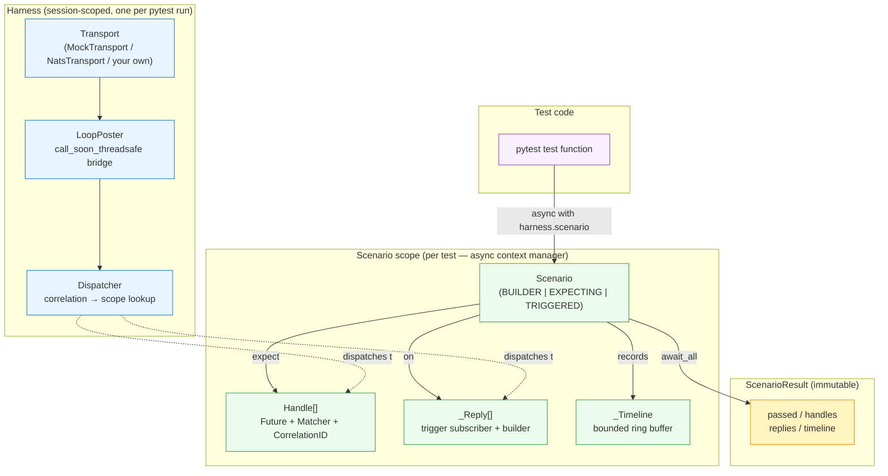
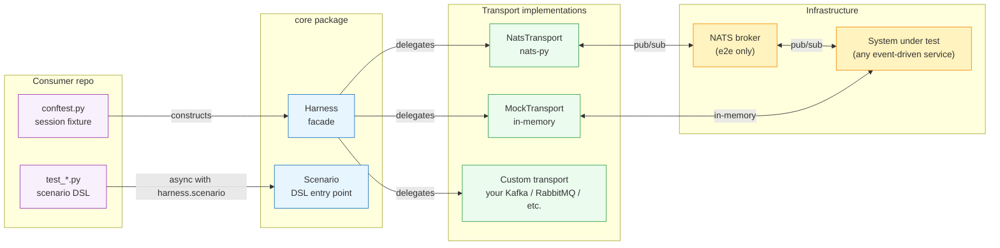
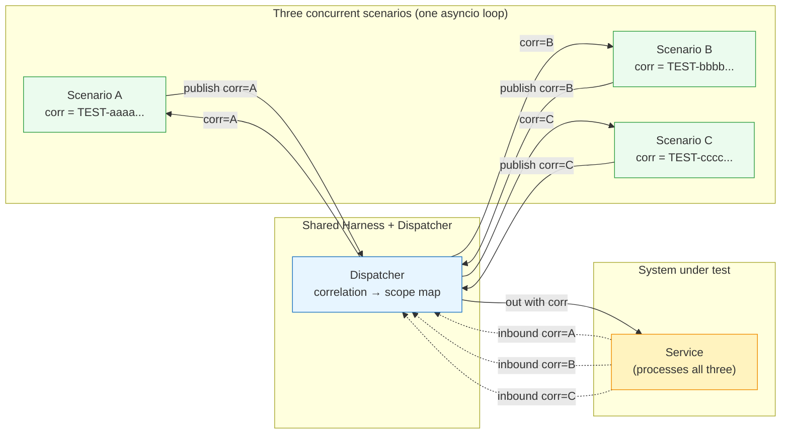

# Framework Design — Choreo Internal Architecture

## Purpose of this document

This is the internal design reference for Choreo. It covers *how the framework is built*: connection lifecycle, test isolation, timeout enforcement, dispatch, and the design patterns that underpin them.

Related documents:

- [context.md](context.md) — writing style and global conventions
- [docs/adr/](adr/) — individual architectural decisions (source of truth for each choice)
- [README.md](../README.md) — outward-facing description, install, quick start

---

## Contents

1. [Constraints](#1-constraints)
2. [Harness lifecycle](#2-harness-lifecycle)
3. [Transport Protocol](#3-transport-protocol)
4. [Dispatcher and correlation mediation](#4-dispatcher-and-correlation-mediation)
5. [Scoped registries and test isolation](#5-scoped-registries-and-test-isolation)
6. [Scenario builder (type-state)](#6-scenario-builder-type-state)
7. [Matchers](#7-matchers)
8. [Reply primitive](#8-reply-primitive)
9. [Deadlines and timeouts](#9-deadlines-and-timeouts)
10. [Error handling and failure recovery](#10-error-handling-and-failure-recovery)
11. [Observability hooks](#11-observability-hooks)
12. [Related ADRs](#12-related-adrs)
13. [Writing style](#13-writing-style)
14. [Appendix — Architecture diagrams](#14-appendix--architecture-diagrams)

---

## 1. Constraints

Locked in before any design work:

- **Language:** Python 3.11+. `asyncio.timeout_at` and `asyncio.timeout` (3.11 additions) are used directly.
- **Async model:** `asyncio`, with `asyncio.Future` per expectation. All callbacks must run on the asyncio loop thread (ADR-0005).
- **Transports:** one long-lived transport instance per process, shared across all tests (ADR-0001). The transport owns its own config; the Harness does not.
- **DSL shape:** fluent builder — `scenario → expect/on → publish → await_all`. Expect-before-publish is a structural guarantee, not a convention (ADR-0012).
- **Test isolation:** per-scenario scope cleanup, correlation-ID routing for parallelism (ADR-0002).
- **No runtime dependencies.** The library does not pull in any queue SDK at import time. `nats-py` is an optional extra; Kafka / NATS / anything else beyond that is consumer-supplied.

---

## 2. Harness lifecycle

The `Harness` is the session-scoped facade (ADR-0001). One instance per pytest run, shared across all tests via a session-scoped `pytest_asyncio` fixture in the consumer's `conftest.py`.

```python
from pathlib import Path
from choreo import Harness
from choreo.transports import MockTransport

transport = MockTransport(allowlist_path=Path("config/allowlist.yaml"))
harness = Harness(transport)
await harness.connect()   # transport opens its socket; allowlist enforced here
# ... run the suite ...
await harness.disconnect()
```

### Why session-scoped

Creating a transport connection on every test is expensive. NATS takes tens of milliseconds; Kafka and other native-SDK-backed transports can take hundreds. Session scope amortises that cost. The risk — shared state between tests — is mitigated by per-scenario subscriber teardown (§5) and correlation-ID routing (§4).

### Lifecycle invariants

- `connect()` is idempotent. Calling it on an already-connected Harness is a no-op.
- `disconnect()` is idempotent regardless of whether the transport raises. If the transport's `disconnect()` raises, the Harness still marks itself disconnected and clears subscriptions so the next call is a clean no-op. The exception propagates.
- `publish()` on a disconnected Harness raises `RuntimeError` immediately — no attempt to reconnect.
- The Harness is not pickleable. Transports hold live sockets and may hold credentials that must not cross a process boundary (ADR-0001).

### pytest-asyncio integration (ADR-0005)

Session-scoped async fixtures require a session-scoped event loop:

```toml
# pyproject.toml
[tool.pytest.ini_options]
asyncio_mode = "auto"
asyncio_default_fixture_loop_scope = "session"
```

Without this, the Harness and the tests run on different loops, producing `RuntimeError: got Future attached to a different loop`.

### Canonical consumer fixture

```python
# consumer-repo/conftest.py
import os
from pathlib import Path
import pytest_asyncio
from choreo import Harness
from choreo.transports import MockTransport   # or NatsTransport, or your own

@pytest_asyncio.fixture(loop_scope="session", scope="session")
async def harness():
    transport = MockTransport(
        allowlist_path=Path(os.environ.get("MY_APP_ALLOWLIST", "config/allowlist.yaml")),
    )
    h = Harness(transport)
    await h.connect()
    try:
        yield h
    finally:
        await h.disconnect()
```

The library ships no fixtures and reads no environment variables. Those are consumer decisions.

---

## 3. Transport Protocol

The Harness speaks only to the `Transport` Protocol (five methods). All queue-specific code lives in the implementing class.

```python
from typing import Protocol, Callable, Optional

TransportCallback = Callable[[str, bytes], None]
OnSent = Callable[[], None]

class Transport(Protocol):
    capabilities: TransportCapabilities

    async def connect(self) -> None: ...
    async def disconnect(self) -> None: ...
    def subscribe(self, topic: str, callback: TransportCallback) -> None: ...
    def unsubscribe(self, topic: str, callback: TransportCallback) -> None: ...
    def publish(
        self,
        topic: str,
        payload: bytes,
        *,
        on_sent: Optional[OnSent] = None,
    ) -> None: ...
```

`on_sent` is invoked by the transport at the post-wire moment — after the bytes have actually left. Synchronous transports (MockTransport) fire it before `publish()` returns. Asynchronous transports (NatsTransport) fire it inside the publish task once the broker has acknowledged the send. Scenarios use this hook to timestamp PUBLISHED and REPLIED events at their true post-wire moment, not at the moment the call was made.

### TransportCapabilities

Each transport declares its semantics via a frozen dataclass:

```python
@dataclass(frozen=True)
class TransportCapabilities:
    broadcast_fanout: bool = True         # each subscribe() delivers independently
    loses_messages_without_subscriber: bool = True  # pub/sub; no durability
    ordered_per_topic: bool = True        # publish order preserved per topic
```

Contract tests read these flags to decide whether a given behaviour should be exercised or skipped. This prevents false failures against transports that deliberately do not honour a given semantic (for example, a Kafka transport configured with a shared consumer group does not broadcast to every subscriber independently).

### Built-in transports

**MockTransport** — in-memory pub/sub. Subscribers fire synchronously before `publish()` returns. Optional allowlist enforcement on `endpoint`. Provides diagnostic methods — `sent()`, `active_subscription_count()`, `clear_subscriptions()` — for tests that want to verify what was published.

**NatsTransport** — talks to a real NATS broker. Lazy-imported: `nats-py` is only loaded when a `NatsTransport` is constructed. Validates `nats_servers` against the allowlist at `connect()` time. Good for exercising the Transport contract end-to-end without production infrastructure.

### Thread-safety contract

Transports are responsible for ensuring callbacks fire on the asyncio loop thread. For transports whose SDK delivers callbacks on a background thread (any native-code SDK that invokes callbacks off the asyncio loop is a canonical example, and any non-asyncio-native transport faces the same problem), the transport uses `LoopPoster` to cross the boundary:

```python
# Inside a non-async-native transport's message handler:
def _on_message(self, raw_topic: bytes, raw_payload: bytes) -> None:
    # This callback fires on the network thread, not the asyncio loop.
    topic = raw_topic.decode()
    self._poster.post(self._fire_callbacks, topic, raw_payload)

def _fire_callbacks(self, topic: str, payload: bytes) -> None:
    # This runs on the loop thread. Safe to touch asyncio Futures.
    for cb in self._subscribers.get(topic, []):
        cb(topic, payload)
```

This is the thread-safety bridge (ADR-0003). Without it, race conditions arise that are timing-sensitive and vanish under a debugger.

### Adding a new backend

Write a module under `packages/core/src/choreo/transports/` implementing the five methods above. The `connect()` implementation owns allowlist enforcement, credential handling, and socket setup. The Harness never sees those details.

---

## 4. Dispatcher and correlation mediation

The `Dispatcher` (ADR-0004) is the single routing point for all inbound messages. It implements the Mediator pattern: decouples the transport's raw callback from the scenario's expectation resolution.

### How routing works

Correlation-based routing is opt-in via the Harness's `CorrelationPolicy`
(ADR-0019). When a consumer configures a non-no-op policy (e.g.
`DictFieldPolicy` or `test_namespace()`), the scope generates an id at entry
via `policy.new_id()`, stamps outbound payloads via `policy.write()`, and
filters inbound messages via `policy.read()`. Under the library default
(`NoCorrelationPolicy`) nothing is stamped, nothing is read, and inbound fans
out to every live scope on the topic.

Under a routing-capable policy, the Dispatcher:

1. Extracts the correlation ID from the raw bytes using a per-topic `Extractor` function (or the policy's `read()`).
2. Looks up the owning scenario by correlation ID — O(1) dict lookup.
3. Calls the scenario's registered resolver.

```
inbound bytes
    │
    ▼
Extractor(topic, bytes) → correlation_id
    │
    ▼
_scopes[correlation_id] → Scenario
    │
    ▼
resolver(scenario, bytes)
    │
    ▼
on_message callback (expect) / on_trigger callback (reply)
```

### Surprise log

Messages the Dispatcher cannot route are recorded in a surprise log. Each entry carries only metadata — topic, correlation ID, payload size, and a classification string — never the raw payload. This prevents test-generated payloads (which may include sensitive data such as API keys or personal identifiers in an IoT or e-commerce context) from appearing in logs. Redaction scope beyond these defaults is a consumer-repo concern (see SECURITY.md).

Classifications:

| Value | Meaning |
|-------|---------|
| `unknown_scope` | Correlation ID not recognised — message arrived before a scenario registered, or from an unrelated sender |
| `timeout_race` | Correlation ID was registered but the scenario has since been torn down — message arrived after the deadline |
| `no_correlation_field` | Extractor returned `None` — payload did not contain a correlation field |
| `no_extractor` | No extractor registered for this topic |

A high count of `timeout_race` entries indicates the system under test is slow relative to the scenario's deadline. A high count of `unknown_scope` entries often indicates a test that publishes before subscribing, or a system that fans out to topics the test did not register.

### Extractor registration

Extractors are pure parsing functions. The Dispatcher refuses extractors that execute payload-supplied code (pickle, marshal, unsafe yaml.load) as a defence against injection via a malicious or corrupted message payload (ADR-0004 §Security).

### Single dispatch point invariant

`Dispatcher.dispatch` cannot be overridden. Python's `__init_subclass__` enforces this at class creation:

```python
class Dispatcher:
    def __init_subclass__(cls, **kwargs):
        super().__init_subclass__(**kwargs)
        if "dispatch" in cls.__dict__:
            raise TypeError(
                f"{cls.__name__} cannot override Dispatcher.dispatch"
            )
```

This is a deliberate structural constraint. Routing logic must stay in one place. Subclasses that want to extend behaviour should use composition.

---

## 5. Scoped registries and test isolation

Sharing one transport across all tests creates the risk that Scenario A's subscribers see Scenario B's messages, or that a subscriber from a completed scenario fires on a subsequent scenario's traffic. Two complementary mechanisms prevent this.

### Mechanism 1 — Scope lifecycle teardown

Every scenario runs inside an `async with harness.scenario(name) as s:` block. On `__aexit__` (normal exit, exception, or deadline), the scope calls `harness.unsubscribe(topic, callback)` for every callback it registered. The transport's subscriber list is clean for the next scenario.

A transport whose `unsubscribe()` raises is logged at WARNING (exception class name only — ADR-0017) and teardown continues. One failing unsubscribe must not abort cleanup of the remaining subscriptions.

### Mechanism 2 — Correlation-based filtering (opt-in, ADR-0019)

When the Harness is constructed with a routing-capable `CorrelationPolicy`,
the filter inside every `on_message` callback rejects messages that carry a
correlation id belonging to another scope:

```python
def on_message(msg_topic: str, raw_payload: bytes) -> None:
    payload = codec.decode(raw_payload)
    if scope_corr is not None:
        msg_corr = policy.read(Envelope(topic=msg_topic, payload=payload))
        if msg_corr is not None and msg_corr != scope_corr:
            return  # another scope's traffic
    # ... proceed to matcher ...
```

When `scope_corr is None` (the `NoCorrelationPolicy` case) or when `read()`
returns `None` (no id present in the message), the filter is skipped and the
matcher sees every routed message — broadcast fallback. Parallel scenarios
are safe under routing only if the system under test echoes the id the
policy produced; consumers who need parallel isolation on shared
infrastructure **must** configure a routing-capable policy.

The combination: scope teardown is the primary isolation primitive; a
correlation policy is the parallelism layer on top, opt-in.

### Correlation ID format

The format is determined by the active `CorrelationPolicy`. Shipped profiles:

- `NoCorrelationPolicy` — no id is generated; scope.correlation_id is `None`.
- `DictFieldPolicy(field, prefix, id_generator)` — id is `prefix +
  id_generator()`; default generator is `secrets.token_hex(16)` (128 bits).
- `test_namespace(field="correlation_id")` — `DictFieldPolicy` with
  `prefix="TEST-"`. Reproduces the pre-ADR-0019 captive posture so
  downstream systems filtering on the `TEST-` prefix continue to work.

Consumers can implement their own policy (header-stamping, tag-value-protocol
tag 11, protobuf field, etc.) by providing `new_id`, `write(envelope, id)`,
and `read(envelope)`. See ADR-0019 for the protocol contract.

### xdist interaction

Under `pytest-xdist`, each worker is a separate Python process. A session-scoped fixture means one transport per worker, not one for the entire run. Parallelism across workers is safe because each worker has its own in-process correlation namespace — two workers will never generate the same correlation ID.

---

## 6. Scenario builder (type-state)

The scenario DSL enforces expect-before-publish structurally (ADR-0012). The `Scenario` object maintains a `_state` flag and raises `AttributeError` when a method is called in the wrong state. This means an IDE or type checker surfaces the violation before the test runs, not at runtime.

### States

```
BUILDER
  │
  │  .expect(topic, matcher)   returns Handle
  │  .on(topic, matcher)       returns ReplyChain
  ▼
EXPECTING
  │
  │  .expect(topic, matcher)   returns Handle (more expectations allowed)
  │  .on(topic, matcher)       returns ReplyChain
  │  .publish(topic, payload)  advances state
  ▼
TRIGGERED
  │
  │  .publish(topic, payload)  returns self (chained publishes allowed)
  │  .await_all(timeout_ms)    returns ScenarioResult
  ▼
(done)
```

`publish()` does not exist on a `BUILDER`-state scenario. Attempting it raises:

```
AttributeError: 'Scenario' in 'builder' state has no attribute 'publish' —
register at least one expectation first (ADR-0012)
```

`expect()` does not exist on a `TRIGGERED`-state scenario. Attempting it raises:

```
AttributeError: 'Scenario' in 'triggered' state has no attribute 'expect' —
register expectations before publish() (ADR-0012)
```

### Why a single class rather than separate types

ADR-0012 originally specified four distinct classes (ScenarioBuilder, ExpectingScenario, TriggeredScenario, ScenarioResult). The implementation reduced this to one `Scenario` class with a runtime `_state` flag. The reason: the `handle = s.expect(...)` pattern requires the caller to hold a reference across the state transition. With separate classes, `s` would be replaced by a new object on each state transition, breaking the `handle` reference. A single mutable object that advances its own state is the simpler shape. The external guarantee — wrong-state calls raise immediately — is identical either way.

### Correlation injection (policy-driven, ADR-0019)

`Scenario.publish()` routes the outbound payload through the active
`CorrelationPolicy`:

```python
envelope = Envelope(topic=topic, payload=payload)
envelope = policy.write(envelope, scope_correlation_id)
payload = envelope.payload
```

Under the library default (`NoCorrelationPolicy`) `write` is an identity
function — the payload reaches the wire untouched. Under `DictFieldPolicy`
(or `test_namespace()`) the policy stamps the configured field onto dict
payloads; non-dict payloads pass through unchanged.

Explicit overrides are honoured: if the payload already carries the
configured field, `write` leaves it alone. If the policy has a `prefix`
configured and the explicit value does not match, `write` raises
`CorrelationIdNotInNamespaceError` — so a trigger-echo cannot smuggle an
upstream id back onto the wire.

### Multiple publishes

`TRIGGERED` state allows further `.publish()` calls. This is the multi-trigger pattern, useful for sagas or workflows that require more than one inbound message:

```python
async with harness.scenario("saga-compensate") as s:
    s.expect("payments.reversed", contains_fields({"status": "REVERSED"}))
    s.expect("inventory.restocked", contains_fields({"sku": "ABC-123"}))
    s.publish("orders.cancelled", {"order_id": "ORD-9", "reason": "user_request"})
    s.publish("saga.compensate", {"order_id": "ORD-9"})
    result = await s.await_all(timeout_ms=1000)
result.assert_passed()
```

---

## 7. Matchers

Matchers implement the Strategy pattern (ADR-0013). Any object satisfying the `Matcher` Protocol can be used with `expect()`:

```python
class Matcher(Protocol):
    description: str
    def match(self, payload: Any) -> MatchResult: ...
    def expected_shape(self) -> Any: ...   # optional; for report diffs
```

`match()` returns a `MatchResult(matched: bool, reason: str, failure: MatchFailure | None)`. The `failure` field carries a structured diff tree that the HTML reporter renders as an expected-vs-actual comparison.

### Built-in matchers

**Scalar comparators:** `eq(v)`, `in_(collection)`, `gt(n)`, `lt(n)`.

**Field extractors** — extract by dotted path (`"a.b.c"`) or integer list index (`"items.0.id"`):
`field_equals(path, v)`, `field_in(path, collection)`, `field_gt(path, n)`, `field_lt(path, n)`, `field_exists(path)`.

**Shape matcher:** `contains_fields(template)` — recursive subset match. Leaves can be literals or other matchers. Lists match positionally.

```python
# e-commerce example
s.expect("orders.dispatched", contains_fields({
    "order_id": "ORD-42",
    "items": [{"sku": "WIDGET-7", "qty": gt(0)}],
    "shipping": {"carrier": in_(("DHL", "FedEx", "UPS"))},
}))
```

```python
# IoT example
s.expect("alerts.triggered", contains_fields({
    "sensor_id": field_exists("sensor_id"),
    "reading": gt(80.0),
    "severity": in_(("WARNING", "CRITICAL")),
}))
```

**Composition:** `all_of(*matchers)`, `any_of(*matchers)`, `not_(matcher)`.

**Raw bytes escape hatch:** `payload_contains(b"...")` — substring check on the raw bytes before decoding. Use this for binary wire formats where structured matching is not possible.

### Near-miss diagnostics

When a handle resolves to `TIMEOUT` or `FAIL`, the `attempts` count tells the caller whether messages arrived at all:

- `attempts == 0` — nothing arrived on the topic matching the scope's correlation. This is a routing bug: the system under test did not respond, or responded on the wrong topic.
- `attempts > 0` — messages arrived but the matcher rejected all of them. This is an expectation bug: the response shape does not match what the test declared.

The `last_rejection_reason` and `last_rejection_payload` fields carry the most recent mismatch for quick diagnosis. The `failures` tuple carries up to 20 structured `MatchFailure` records for the reporter to render.

### Writing a custom matcher

A matcher is a frozen dataclass with a `description` string and a `match(payload)` method:

```python
from dataclasses import dataclass
from choreo.matchers import MatchResult

@dataclass(frozen=True)
class HasSagaStatus:
    expected_status: str

    @property
    def description(self) -> str:
        return f"saga_status == {self.expected_status!r}"

    def match(self, payload: object) -> MatchResult:
        if not isinstance(payload, dict):
            return MatchResult(False, "payload is not a dict", None)
        actual = payload.get("saga_status")
        if actual == self.expected_status:
            return MatchResult(True, f"saga_status == {actual!r}", None)
        return MatchResult(False, f"saga_status {actual!r} != {self.expected_status!r}", None)
```

Custom matchers compose with the built-ins via `all_of`, `any_of`, and `not_`.

---

## 8. Reply primitive

The `on().publish()` primitive (ADR-0016, ADR-0017, ADR-0018) lets a test react to inbound messages and publish a response. Its purpose is to stage a fake upstream service inside a single test without standing up a second process.

```python
async with harness.scenario("approve-then-ship") as s:
    # Declare what we expect back
    h = s.expect("shipments.created", contains_fields({"status": "CREATED"}))

    # When the approval service receives the request, publish an approval reply
    s.on("approvals.requested").publish(
        "approvals.granted",
        lambda msg: {
            "approval_id": msg["request_id"],
            "approved_by": "auto-approver",
        },
    )

    s.publish("approvals.requested", {"request_id": "REQ-77", "amount": 49.99})
    result = await s.await_all(timeout_ms=500)

result.assert_passed()
```

In this pattern the test is acting as the approval service. The system under test publishes `approvals.requested`; the test's reply subscriber picks it up and publishes `approvals.granted`; the system under test's shipping component sees the approval and creates a shipment.

### Rules

**Registration before publish (ADR-0016).** Replies must be registered before `publish()` is called. The scenario enforces this via the type-state machine: `on()` is only available in `BUILDER` and `EXPECTING` states. This prevents a race where the trigger message arrives before the reply subscriber is in place.

**Fire-once (ADR-0016).** Each `ReplyChain` fires at most once. If the trigger arrives a second time, the subscriber records the additional candidate but skips the matcher and builder. This prevents a runaway sender from generating unbounded outbound traffic.

**Single-use chain.** Calling `.publish()` twice on the same `ReplyChain` raises `ReplyAlreadyBoundError`. Register a second reply with a fresh `.on()` call.

**Payload forms.** The reply payload can be:
- A `dict` — encoded via the harness codec.
- `bytes` — passed through verbatim.
- A `Callable[[decoded_trigger_payload], dict | bytes]` — the builder function. Called once per firing.

**Builder error isolation (ADR-0017).** If the builder raises, the reply is not published, the scenario continues, and the error is recorded as `builder_error` on the `ReplyReport` using the exception class name only — never `str(e)`. This is a deliberate security boundary: a builder that raises may be processing payload-derived content; logging the full exception string could leak that content.

### Reply observability

Each registered reply produces a `ReplyReport` in `ScenarioResult.replies`:

```python
report = result.reply_at("approvals.requested")
assert report.state.name == "REPLIED"
assert report.match_count == 1
```

Report states:

| State | Meaning |
|-------|---------|
| `REPLIED` | Builder ran and reply was published |
| `REPLY_FAILED` | Builder raised, or publish raised |
| `ARMED_NO_MATCH` | No message arrived on the trigger topic |
| `ARMED_MATCHER_REJECTED` | Messages arrived but the optional matcher rejected all of them |

### Consumer-owned helper modules

The framework ships the primitive only. Consumer repos compose replies into named helpers:

```python
# consumer-repo/src/my_app/test_helpers/approvals.py

def auto_approve(scenario, *, request_topic: str, approval_topic: str) -> None:
    """Stage an automatic approval reply for the approval service."""
    scenario.on(request_topic).publish(
        approval_topic,
        lambda msg: {
            "approval_id": msg["request_id"],
            "approved_by": "test-auto-approver",
        },
    )
```

This helper lives in the consumer repo, not in the library. The library does not ship domain-specific bundles. Each consumer builds the bundle that matches its own system's contracts.

---

## 9. Deadlines and timeouts

`await_all(timeout_ms=N)` enforces a per-scenario deadline using `asyncio.timeout_at` and `asyncio.wait(return_when=ALL_COMPLETED)` (ADR-0015).

```python
loop = asyncio.get_running_loop()
deadline = loop.time() + timeout_ms / 1000
futures = [e.fulfilled for e in context.expectations]

try:
    async with asyncio.timeout_at(deadline):
        await asyncio.wait(futures, return_when=asyncio.ALL_COMPLETED)
except TimeoutError:
    pass  # expected; pending handles receive TIMEOUT or FAIL below
```

`asyncio.wait(ALL_COMPLETED)` returns when every future is done or the context manager fires. It does not cancel pending futures on timeout — the code after the block does that explicitly, assigning `TIMEOUT` or `FAIL` to each unresolved handle before cancelling its future.

### Why not `pytest-timeout`

`pytest-timeout` uses SIGALRM (Unix) or thread interruption (cross-platform). Both are unsafe in an asyncio context: SIGALRM interrupts the event loop at an arbitrary point; thread interruption terminates the loop thread and leaks transports. `asyncio.timeout_at` is the correct primitive — it integrates with the event loop's scheduler and unwinds cleanly.

### Per-expectation budgets

`handle.within_ms(budget_ms)` declares a latency SLA on a single expectation. A message that matches but arrives after the budget resolves as `Outcome.SLOW`, which fails the scenario. The budget is checked inside the `on_message` callback:

```python
latency_ms = (done_t - exp.registered_at) * 1000
if budget is not None and latency_ms > budget:
    handle.outcome = Outcome.SLOW
else:
    handle.outcome = Outcome.PASS
```

Budget and scenario deadline interact as follows: the scenario deadline is the outer bound; the per-expectation budget is an inner bound that can only make the test stricter, not looser.

### Deadline semantics at scope exit

The scenario deadline starts when `await_all()` is called, not when the scope is entered. In practice:

```
scope entered at t=0
expect() registered at t=1ms
publish() called at t=5ms
await_all(timeout_ms=500) called at t=6ms
deadline fires at t=506ms
```

Any handle that has not resolved by the deadline fires its `DEADLINE` timeline event and is assigned `TIMEOUT` (no message arrived) or `FAIL` (messages arrived but matcher rejected them).

---

## 10. Error handling and failure recovery

### Harness failure recovery (ADR-0007)

The Harness is not a production client. If the transport connection drops mid-suite, the correct response is to fail the remaining tests visibly — not to retry silently and hide the failure. The recovery policy is:

- Detect connection loss (transport raises or signals disconnection).
- Mark the Harness as degraded.
- Subsequent `publish()` calls raise immediately.
- Subsequent `connect()` calls attempt a reconnect up to a configurable ceiling.

### Scenario-level isolation from failures

An unhandled exception inside a scenario body must not abort the suite. The `_ScenarioScope.__aexit__` catches all exits, normal or exceptional:

- **Normal exit without `await_all()`** — a `UserWarning` is logged; PENDING handles are resolved to `TIMEOUT` with a descriptive reason string. The result is emitted to the reporter.
- **Exception before `await_all()`** — PENDING handles resolved to `TIMEOUT`; partial result emitted; exception propagates (pytest marks the test as failed).
- **Exception after `await_all()` returns** — the primary result is already reported; a `WARNING` log is emitted noting teardown raised; the exception propagates.

This guarantees the reporter always receives a result for every scope — no scope is silently dropped.

### Codec errors in callbacks

A codec exception inside an `on_message` or `on_trigger` callback must not abort the transport's dispatch loop. Sibling subscribers on the same topic would otherwise be starved. The callback logs at `WARNING` (exception class name only) and returns:

```python
try:
    payload = codec.decode(raw_payload)
except Exception as e:
    _LOG.warning(
        "codec.decode raised %s on topic %r; subscriber ignoring this message",
        type(e).__name__,
        msg_topic,
    )
    return
```

### Unsubscribe failures at teardown

If `transport.unsubscribe()` raises during scope teardown (network error, transport bug), cleanup continues. The failure is logged at `WARNING`. This prevents a single misbehaving transport from leaking every remaining subscriber.

---

## 11. Observability hooks

### Timeline

The `_Timeline` records every significant event in a scenario scope as a `TimelineEntry` with a monotonic offset from scope start. The HTML reporter renders these as a Jaeger-style waterfall.

Events:

| Action | What it records |
|--------|----------------|
| `PUBLISHED` | A message left the test via `s.publish()` |
| `RECEIVED` | A subscriber callback saw a message (before matcher runs) |
| `MATCHED` | The matcher accepted the payload |
| `MISMATCHED` | The matcher rejected the payload (near-miss) |
| `DEADLINE` | The scenario timeout fired on an unresolved handle |
| `REPLIED` | A reply was published (post-wire, via `on_sent` hook) |
| `REPLY_FAILED` | A reply builder or publish raised |

`PUBLISHED` and `REPLIED` are timestamped via the transport's `on_sent` hook — after the bytes have left, not at the moment the call was made. For NATS this distinction is meaningful: `harness.publish()` may return before the broker has acknowledged. Without the hook, the propagation latency bar on the waterfall would be inflated by the async send time.

`RECEIVED` is timestamped at callback entry, before the matcher runs. The bar from `RECEIVED` to `MATCHED`/`MISMATCHED` is the matcher's evaluation time. The bar from `PUBLISHED`/`REPLIED` to `RECEIVED` is honest transport propagation.

The timeline is bounded at 256 entries per scope. Overflow drops the oldest entries and increments `timeline_dropped`. A flooded scope pays O(1) per append due to the deque's `maxlen`.

### Credential redaction (ADR-0017; consumer-owned scope)

No payload content appears in logs. The surprise log carries metadata only (topic, correlation ID, size, classification). Builder errors in replies record the exception class name only. The HTML reporter passes all payload text through a pluggable redactor chain before rendering:

```python
from choreo_reporter import register_redactor
import re

def mask_tokens(text: str) -> str:
    return re.sub(r"tok_[A-Za-z0-9]{32}", "tok_REDACTED", text)

register_redactor(mask_tokens)
```

### Result model

`ScenarioResult` is the immutable summary produced by `await_all()`:

| Field / method | What it gives you |
|----------------|------------------|
| `result.passed` | True iff every handle resolved as `PASS` |
| `result.assert_passed()` | Raises `AssertionError` with full breakdown on failure |
| `result.handles` | Tuple of every Handle |
| `result.failing_handles` | Handles where outcome is not `PASS` |
| `result.timeline` | Ordered `TimelineEntry` tuple |
| `result.replies` | Tuple of `ReplyReport`, one per `on()` call |
| `result.failure_summary()` | Multi-line diagnostic with last 20 timeline entries |
| `result.reply_at(trigger_topic)` | Lookup a reply report by trigger topic |

`assert_passed()` is the canonical assertion. Its error message distinguishes a silent timeout (routing bug) from a near-miss timeout (expectation bug) — the two require different fixes and the message must make that obvious.

`ScenarioResult` is not pickleable. It may carry payload content in Handle fields that must not cross a process boundary (ADR-0017).

---

## 12. Related ADRs

The ADRs are the authoritative source of truth for each decision. This section is a reading guide.

| ADR | Title | One-line decision |
|-----|-------|------------------|
| [0001](adr/0001-single-session-scoped-harness.md) | Single session-scoped Harness | One Harness per pytest session; shared across all tests |
| [0002](adr/0002-scoped-registry-test-isolation.md) | Scoped registry + correlation IDs | `async with scenario_scope` teardown + correlation-ID routing |
| [0003](adr/0003-threadsafe-call-soon-bridge.md) | Thread-safety bridge | `loop.call_soon_threadsafe` via `LoopPoster`; AST CI check; callable whitelist |
| [0004](adr/0004-dispatcher-correlation-mediator.md) | Dispatcher as Mediator | Single dispatch point; O(1) correlation lookup; subclassing of `dispatch` refused |
| [0005](adr/0005-pytest-asyncio-session-loop.md) | Session-scoped event loop | `loop_scope="session"` in `pyproject.toml`; requires pytest-asyncio >= 0.24 |
| [0006](adr/0006-environment-boundary-enforcement.md) | Environment-boundary enforcement | Allowlist YAML at `connect()`; `TEST-` prefix on all outbound; default-deny |
| [0007](adr/0007-harness-failure-recovery.md) | Harness failure recovery | Quarantine-and-rebuild on detected corruption; no automatic retries |
| [0012](adr/0012-type-state-scenario-builder.md) | Type-state scenario builder | Runtime state flag with `AttributeError` on illegal calls; `publish` absent until `expect` |
| [0013](adr/0013-matcher-strategy-pattern.md) | Matcher Strategy pattern | `Matcher` Protocol; built-ins; `all_of`/`any_of`/`not_` composition |
| [0014](adr/0014-handle-result-model.md) | Handle-based result model | `expect()` returns a Handle; resolved state survives scope teardown; not pickleable |
| [0015](adr/0015-deadline-based-scenario-timeouts.md) | Deadline-based scenario timeouts | `asyncio.timeout_at` + `asyncio.wait(ALL_COMPLETED)`; collect all results then cancel |
| [0016](adr/0016-reply-lifecycle.md) | Reply lifecycle | `on()` is a subscription; fire-once; deregister on scope exit; no post-publish registration |
| [0017](adr/0017-reply-fire-and-forget-results.md) | Reply fire-and-forget results | Replies are not assertions; observability via `ReplyReport`; builder-error class name only |
| [0018](adr/0018-reply-correlation-scoping.md) | Reply correlation scoping | Same correlation filter as `expect`; scope correlation stamped on reply dict |

ADR-0011 (adversarial SUT handling) is planned but not yet written.

Recommended reading order for a new contributor: 0005 → 0001 → 0003 → 0002 → 0004 → 0006 → 0007 → 0012 → 0013 → 0014 → 0015 → 0016 → 0017 → 0018.

---

## 13. Writing style

These rules apply to all ADRs, PRDs, and this document. Violation is a code-review block.

- **UK English.** Colour, behaviour, authorise, licence (noun), license (verb).
- **No em-dashes in code.** Fine in prose; confusing in identifiers and string literals.
- **Banned weasel words.** Do not use: `leverage`, `seamless`, `robust` (as vague praise), `well-understood`, `easy to X`. These phrases say nothing about the actual trade-off.
- **Terse and direct.** One idea per sentence. Say what the system does, not what it is "designed to" do.
- **Behaviour over implementation in test names.** Use "should" or "should not". See [CLAUDE.md](../CLAUDE.md) for examples.

---

## 14. Appendix — Architecture diagrams

### Component overview



### Harness + Transport wiring



### Scenario lifecycle (sequence)

```mermaid
sequenceDiagram
    autonumber
    participant Test as Test function
    participant Scope as Scenario scope
    participant Harness as Harness
    participant SUT as System under test
    participant Dispatcher as Dispatcher

    Test->>Harness: async with harness.scenario("process-payment")
    Harness->>Scope: new scope, fresh correlation ID, empty timeline
    Scope-->>Test: Scenario (state=BUILDER)

    Test->>Scope: .expect("payments.confirmed", contains_fields({...}))
    Scope-->>Test: Handle (state=EXPECTING)
    Note over Test,Scope: publish() unavailable in BUILDER state

    Test->>Scope: .publish("payments.requested", payload)
    Scope->>Harness: inject correlation_id, encode, publish
    Harness->>SUT: bytes on wire
    Scope-->>Test: Scenario (state=TRIGGERED)

    Test->>Scope: await .await_all(timeout_ms=500)
    Scope->>Harness: asyncio.timeout_at + wait(ALL_COMPLETED)

    SUT-->>Harness: inbound bytes on "payments.confirmed"
    Harness->>Dispatcher: topic + bytes
    Dispatcher->>Scope: correlation matched → on_message callback
    Scope->>Scope: matcher.match(payload) → PASS
    Scope->>Scope: handle.outcome = PASS; future resolved

    Scope-->>Test: ScenarioResult (all handles PASS)

    Test->>Scope: __aexit__
    Scope->>Harness: unsubscribe all callbacks
    Note over Harness: Next scenario enters a fresh scope
```

### Parallel scenarios via correlation routing



### Reply flow (on().publish())

```mermaid
sequenceDiagram
    autonumber
    participant Test as Test function
    participant Scope as Scenario scope
    participant SUT as System under test

    Test->>Scope: .on("sensor.reading").publish("alerts.ack", builder)
    Note over Scope: Reply subscriber registered (ARMED)

    Test->>Scope: .publish("sensor.reading", {sensor_id: "S01", value: 95.2})
    Scope-->>SUT: bytes on "sensor.reading" (with correlation_id)

    SUT->>SUT: processes reading, publishes to "alerts.created"

    SUT-->>Scope: inbound "sensor.reading" echo (or another consumer echoes)
    Scope->>Scope: correlation filter passes
    Scope->>Scope: builder({sensor_id: "S01", value: 95.2}) → {ack: true}
    Scope->>Scope: state = REPLIED
    Scope-->>SUT: bytes on "alerts.ack"

    Note over Scope: on_sent fires → REPLIED event in timeline

    SUT-->>Scope: inbound "alerts.created" (from system response)
    Scope->>Scope: matcher.match → PASS; handle resolved
```
